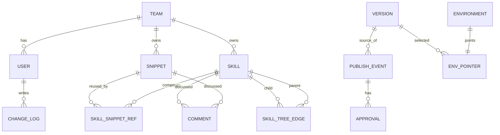

# Hello

---
slug: untitled-page-auzg
kb: default-kb
tier: 2
status: draft
updated_at: 2026-02-13T02:14:26.701Z
---

lknn

<!-- snippet:cta-2 -->
Close with a strong call to action.

**bold text**

# Knowledge Operations Platform for Teams

## Executive summary

A “Knowledge Operations Platform” that feels like Notion for writing and like Figma for structure should treat knowledge as composable, reusable, governed building blocks. The winning wedge is a snippet library that behaves like components in a design system, plus a skill tree composer, plus a safe publish pipeline that exports deterministic Markdown to GitHub as a single atomic commit or a PR, depending on risk tier. This blends proven patterns from Notion’s synced blocks, Figma libraries, and enterprise governance from tools like Confluence, Document360, Guru, and Bloomfire. citeturn8search16turn0search9turn0search25turn8search3turn0search18turn7search2

In my opinion, the world class UX is a three pane workspace where users never touch Git concepts, but always get impact visibility, auditability, and safe rollbacks. Under the hood, every publish is an immutable snapshot, similar in spirit to Git commits being snapshots, not diffs. citeturn6search0turn3search1

Key decisions that remove ambiguity:

- **Canonical model**: Postgres is source of truth, GitHub is the export channel, not the editing surface.
- **Reuse semantics**: snippets are true single source transclusions, not copy and paste. citeturn8search0turn2search0turn8search3
- **Governance**: tiering drives publish path, Tier one requires PR and approval, Tier two can direct commit.
- **Versioning**: per snippet revisions for day to day work, plus immutable global snapshots for release, rollback creates a new revision, never destructive. citeturn6search2turn6search0

## Competitive audit

The strongest competitor patterns to borrow are “reusable content by reference” and “trust signals with owners and review cadences.” Notion implements transclusion via synced blocks and even frames it explicitly as transclusion inspired design. citeturn8search16turn8search0 Confluence supports reusable excerpts as a single source via excerpt macros and insert excerpt macros. citeturn8search7turn8search28 Document360 explicitly offers snippet libraries as reusable content blocks, plus workflow and inline review features aimed at governance. citeturn8search3turn1search2turn9search2

### Competitor comparison table

| Product | Best at | Reuse model | Governance model | Versioning model | Implication for your platform |
|---|---|---|---|---|---|
| Notion | Fast authoring, workspace permissions, wiki verification | Synced blocks for reusable content, plus page and database structures | Verified pages and owners, granular page and database permissions | Page version history and restore | You must match ease of editing, but add explicit impact analysis and release workflows. citeturn8search0turn0search2turn0search5turn7search13 |
| Figma | Component libraries and controlled updates | Published libraries, instances update via accept or ignore | Library publishing permissioning | Update acceptance as a change gate | Your snippet updates should support “accept update” via pinning to revisions when needed. citeturn0search9turn0search6 |
| Confluence | Enterprise permissions and structured wiki operations | Excerpt and include style reuse | Global, space, and content restrictions, plus inline comments | Page history with compare and restore | Your tier model is an evolution of content restrictions, but applied to agent risk. citeturn0search25turn8search7turn7search0 |
| Guru | Trust and freshness signals | Cards as atomic knowledge units | Verification states with verifiers and timestamps | Version tracking at card level | “Verified” needs to be first class for Tier one and customer facing outputs. citeturn8search4turn8search5turn0search18 |
| Slab | Lightweight internal wiki with structure | Topic based organisation | Topic permissions | Post version history and restore | Structure is simpler than your skill tree, but the permission ergonomics are instructive. citeturn1search4turn1search0turn7search1 |
| Bloomfire | Moderation and approvals | Content centric | Approval flows, unpublish, restore previous versions | Tracks versions and engagement | Borrow “moderation tools” UX for approvals, but keep your editing composable. citeturn7search2turn7search8 |
| Document360 | Documentation governance | Snippet library, plus content reuse tooling | Workflow status button, reviewers, inline comments | Enhanced versioning and rollback | Closest conceptual match, but your differentiator is skill graph plus GitHub export. citeturn8search3turn1search2turn1search10turn9search2 |
| Retool | Admin console patterns | Reusable UI components, not knowledge | Environment and permissions patterns, audit logs | Action audit logs | Use its dense admin patterns for dashboards and audit views. citeturn1search23turn1search11turn1search35 |

## Snippet reuse best practices

The strongest evidence based pattern is “include by reference,” where the referenced unit is the single source and all embeddings reflect updates. This is a mature concept in structured authoring: DITA’s conref exists precisely to reference reusable content elements. citeturn2search0turn2search5 Confluence’s excerpt reuse describes the same operational idea for wikis. citeturn8search7turn8search28 Notion’s synced blocks similarly update once and propagate, and explicitly maintains a reverse usage list to help users understand where content is used. citeturn8search16turn8search0

In my opinion, your platform should implement five reuse rules:

- **Canonical snippet library**: every reusable block has an owner, tier, status, and stable slug path.
- **Transclusion by default**: embedding a snippet pulls the canonical content at compile time, never copies it, unless the user explicitly chooses “fork.” citeturn2search0turn8search0turn8search3
- **Controlled updates for risky content**: borrow Figma’s “accept update” concept by allowing skill nodes to pin to a snippet revision when Tier one governance requires stability. citeturn0search9turn0search6
- **Usage visibility**: every snippet shows “used in” and a tier impact breakdown, mirroring Notion’s design goals and ensuring safe edits. citeturn8search16turn8search0
- **Naming and governance hygiene**: meaningful names and regular checks, Document360 explicitly recommends this for content reuse programmes. citeturn8search14turn8search3

## Governance, versioning, and collaboration

A draft, review, live model aligns with how documentation platforms manage lifecycle. Document360 describes workflow statuses for authoring and review, and supports reviewer assignment and inline review loops. citeturn1search2turn1search6turn9search2 Bloomfire markets approval flows and restoring previous versions, reflecting the same governance need in larger organisations. citeturn7search2turn7search8 Guru’s verification system adds a crucial trust signal that should map cleanly onto Tier one. citeturn8search5turn0search18

### Workflow model that minimises incidents

In my opinion the simplest unambiguous model is:

- **Draft** is always editable by permitted editors.
- **Review** is a staging pointer for approvals and validation.
- **Live** is read only, always a pinned immutable snapshot.

For Tiering, borrow the enterprise conviction behind restrictions and verification, but apply it explicitly to agent blast radius:

- Tier one is customer facing, revenue affecting, policy, compliance, automation triggers.
- Tier two is operational guidance and internal definitions.
- Tier three is sandbox and experiments.

### Versioning strategy

Git’s core mental model is snapshots over time, which maps cleanly to global knowledge releases. citeturn6search0turn6search12 Event sourcing literature emphasises immutable append only changes as an audit trail and as a way to reconstruct past state. citeturn6search2turn6search14

In my opinion, the safest hybrid is:

- **Per snippet revision**: supports rapid iteration and history at the unit level.
- **Global immutable Version snapshot**: every publish compiles the entire tree with resolved snippet bodies and produces a deterministic export.

Rollback should be “revert as new revision,” never delete history. This aligns with immutable event thinking and avoids compliance and audit gaps. citeturn6search2turn6search14

### Collaboration features that matter

Teams expect modern async feedback patterns:

- Notion supports comments, discussions, and @mentions. citeturn9search1turn9search4
- Confluence supports inline comments and mentions, with resolution. citeturn9search0turn9search9
- Document360 supports inline comments with @mentions and review roles. citeturn9search2turn9search19
- Figma makes comments a first class collaboration mode with mentions and resolvable threads. citeturn9search3turn9search16turn9search8

Your platform should implement comments on both Skill nodes and Snippets, plus suggestions mode for snippet edits when the user lacks publish rights.

## UX patterns and proposed data model

image_group{"layout":"carousel","aspect_ratio":"16:9","query":["Notion synced block UI example","Figma layers panel components library UI","Confluence excerpt macro include UI","Document360 snippets library UI"],"num_per_query":1}

### Interaction model

In my opinion, the UX should crystallise into four primary surfaces:

- **Workspace**: three pane editor.
- **Snippet Library**: search, filter, owners, tiers, usage counts, orphan detection.
- **Publishing**: impact and governance modal, with preview and diffs.
- **Ops Dashboard**: audit trail, incidents, rollbacks, adoption metrics.

Minimal wireframe sketch:

```text
[Skill Tree]          [Skill Canvas]                         [Inspector]
Search...             Skill: Campaign Analysis               Snippet: Attribution Definition
- Growth              Tier: 1  Status: Draft                 Owner: Marketing  Tier: 2
  - Reporting         Blocks:                                Used in: 12 skills, 3 Tier 1
  - Attribution       [Snippet Card] Attribution Definition  History: r7, r6, r5
- Operations          [Snippet Card] Weekly Report Template   Edit: Markdown + Preview
                      [+ Add Snippet]  [Add Child Skill]      [Comments] [Diff]
```

### Entity relationship diagram



### Required objects and fields

Below are required fields for an internal first system. Types are pragmatic, Postgres friendly, and API friendly.

| Object | Required fields and types |
|---|---|
| Skill | `id: uuid`, `slug: string`, `title: string`, `description: string|null`, `tier: int`, `status: enum(draft,review,live,archived)`, `ownerTeamId: uuid`, `createdBy: uuid`, `updatedBy: uuid`, `createdAt: datetime`, `updatedAt: datetime`, `revision: int` |
| Snippet | `id: uuid`, `slug: string`, `title: string`, `bodyMarkdown: string`, `languageTag: string`, `tier: int`, `status: enum(draft,review,live,archived)`, `ownerTeamId: uuid`, `createdBy: uuid`, `updatedBy: uuid`, `createdAt: datetime`, `updatedAt: datetime`, `revision: int`, `provenance: object|null` |
| Version | `id: uuid`, `versionNumber: int`, `createdAt: datetime`, `createdBy: uuid`, `snapshotJson: object`, `manifestJson: object`, `gitRepo: string`, `baseBranch: string`, `commitSha: string|null`, `buildStatus: enum(queued,running,succeeded,failed)` |
| PublishEvent | `id: uuid`, `requestedBy: uuid`, `requestedAt: datetime`, `sourceVersionId: uuid`, `policyResult: enum(tier2_direct,tier1_pr,blocked)`, `status: enum(queued,running,awaiting_review,success,failed,merged)`, `idempotencyKey: string`, `correlationId: uuid`, `commitSha: string|null`, `prUrl: string|null` |
| ChangeLog | `id: uuid`, `actorUserId: uuid`, `actedAt: datetime`, `objectType: enum(skill,snippet,edge,ref,env,version,publish)`, `objectId: uuid`, `action: enum(create,update,reorder,delete,request_publish,complete_publish,approve,reject)`, `beforeJson: object|null`, `afterJson: object|null`, `clientMeta: object|null` |

Internationalisation baseline should follow BCP forty seven language tags for content language identification, the entity["organization","World Wide Web Consortium","web standards body"] references BCP forty seven in its language tagging guidance. citeturn4search2turn4search6

Example JSON fragments:

```json
{
  "snippet": {
    "id": "uuid",
    "slug": "attribution-definition",
    "title": "Attribution definition",
    "languageTag": "en-GB",
    "tier": 2,
    "status": "draft",
    "revision": 7,
    "bodyMarkdown": "## Attribution\nAttribution is..."
  }
}
```

```json
{
  "skill": {
    "id": "uuid",
    "slug": "campaign-analysis",
    "title": "Campaign analysis",
    "tier": 1,
    "snippetRefs": [
      {"snippetId": "uuid", "sortOrder": 10, "mode": "full"}
    ],
    "children": ["channel-analysis", "creative-analysis"]
  }
}
```

### Conflict handling

For V one, optimistic concurrency is usually enough: clients submit last seen revision, server rejects on mismatch. Classic optimistic concurrency control literature shows it is effective when conflicts are relatively rare. citeturn6search25turn6search7

Later, add advisory locks for long running operations like publishes. PostgreSQL documents advisory locks as application defined locks useful when MVCC is awkward, and provides pg_advisory_lock functions. citeturn5search7turn5search3

## GitHub export, telemetry, accessibility, and security

### Export and commit flow to GitHub

Use GitHub Apps for automation. Installation access tokens expire after one hour and are designed for this integration style. citeturn3search0turn3search20

Use GraphQL createCommitOnBranch for a single atomic commit because it appends a commit and updates the branch head, similar to git commit. citeturn3search1turn3search13

For Tier one, create a branch and PR, then request reviewers via the PR APIs. citeturn3search23turn3search7turn3search3

Validate webhooks using the HMAC signature header X Hub Signature two five six, GitHub documents this mechanism. citeturn3search2turn3search6 Webhook best practices also recommend keeping processing fast and using secrets. citeturn3search22

Idempotency is mandatory for publish jobs. Borrow the idempotency key concept from payment APIs: Stripe documents that the same idempotency key can safely return the same stored result across retries. citeturn5search2turn5search19
